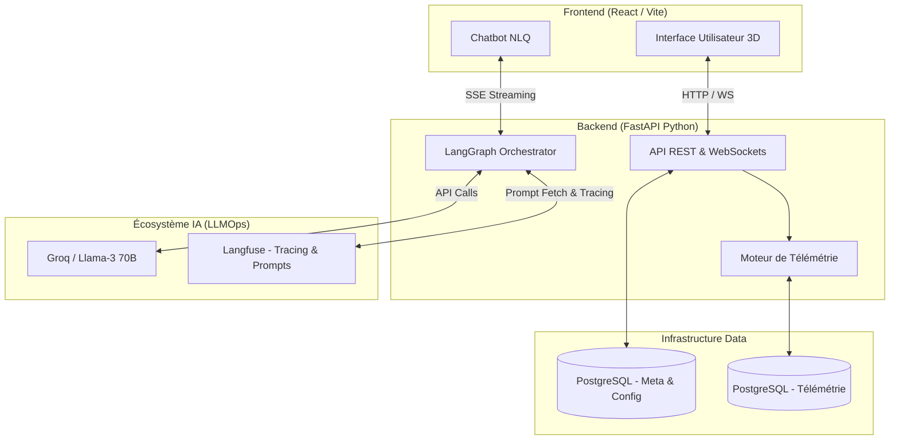

# Plateforme Jumeau Numérique (Digital Twin) Intelligent

Bienvenue sur le dépôt de la plateforme **Digital Twin Intelligent**, une solution d'entreprise permettant de modéliser, visualiser et interagir avec des environnements industriels (usines, entrepôts, aéroports) en temps réel. Grâce à une intégration avancée d'agents IA (Multi-Agent System) et de pratiques **LLMOps**, cette plateforme transcende la simple visualisation de données pour offrir une véritable assistance proactive.

## 🌟 Vision et Fonctionnalités

- **Modélisation 3D Dynamique** : Visualisation spatiale via un moteur 3D haute performance (React Three Fiber).
- **Streaming de Télémétrie** : Ingestion et traitement de métriques avec une latence sub-seconde via WebSockets.
- **Système Multi-Agents (MAS)** : Un écosystème de 5 agents d'IA spécialisés gérant la configuration, le layout 3D, le requêtage de données, la data-visualisation et le reporting.
- **Opérations IA (LLMOps) Grade Production** : Tracing complet, gestion dynamique des prompts (Langfuse), sécurisation des sorties (Guardrails Pydantic) et boucle d'amélioration continue (Data Flywheel).
- **Architecture SaaS Sécurisée** : Isolation stricte des locataires (Multi-tenancy), protection SSRF, et cloisonnement de l'Event Loop asynchrone.

---

## 🏛️ Architecture Globale de la Solution

L'architecture est pensée pour séparer la collecte de données haute fréquence, le traitement cognitif (IA) et l'interface utilisateur.



---

## 🤖 Écosystème Multi-Agents (LangChain / LangGraph)

Le cerveau de l'application ne repose pas sur un seul modèle générique, mais sur un **réseau d'agents spécialisés**. Cette approche modulaire permet de réduire drastiquement les hallucinations et d'augmenter la pertinence métier.

1. **KPI Agent (`kpi_agent.py`)** : Intervient lors du "Wizard" de configuration initiale. En fonction du domaine industriel (ex: Usine 4.0), il analyse le schéma brut de la base de données de télémétrie et propose automatiquement des indicateurs de performance clés (ex: OEE, Taux de défaut) avec des seuils d'alerte mathématiquement pertinents.
2. **Layout Agent (`layout_agent.py`)** : Le "Spatial Designer". Il analyse la liste des machines (composants) connectées et génère des coordonnées (X, Y, Z) cohérentes. Par exemple, il alignera des machines d'assemblage en ligne droite pour simuler une chaîne de production réaliste en 3D.
3. **NLQ Agent (`nlq_agent.py`)** : Le "Data Analyst". Il reçoit les questions de l'utilisateur (ex: "Où est le goulot d'étranglement ?"). Il dispose de "Tools" (Outils Python) pour interroger la base de données. Il utilise ces outils pour calculer des statistiques et des tendances temporelles, puis formule une réponse textuelle claire et ordonne la création d'un graphique.
4. **Chart Agent (`chart_agent.py`)** : Le "Dataviz Expert". Il reçoit les instructions du NLQ Agent ("Fais un graphique en barre de la consommation d'énergie") et génère un schéma JSON strict compatible avec la librairie frontend Recharts.
5. **Report Agent (`report_agent.py`)** : L'"Ingénieur de Fiabilité". Il est capable de lire l'état de l'usine entière, de repérer les anomalies chroniques, et de rédiger un rapport exécutif complet avec des recommandations de maintenance prédictive.

---

## 🚀 Infrastruture LLMOps (Mise en Production)

Pour passer d'un prototype à un produit "Enterprise-Ready", le système intègre les meilleures pratiques d'Opérations de modèles d'Intelligence Artificielle (LLMOps) :

### 1. Guardrails (Sécurité et Fiabilité)
Les sorties des LLMs sont intrinsèquement imprévisibles. Pour éviter qu'un JSON mal formaté ne fasse crasher l'interface graphique :
- **Implémentation** : Utilisation de `PydanticOutputParser` issu de Langchain. 
- **Mécanisme** : Le NLQ Agent a un schéma de réponse strict imposé par Pydantic. Si le modèle génère du texte hors format (ex: du blabla avant le JSON), le système l'intercepte, et si besoin, le force à se corriger. Le frontend reçoit ainsi toujours un format 100% fiable.

### 2. Gestion Centralisée des Prompts (Prompt Management)
Les instructions systèmes (System Prompts) ne sont plus figées dans le code source ou la base de données locale.
- **Implémentation** : Intégration du client **Langfuse Prompt Management**.
- **Avantage** : Au moment d'analyser la requête, le backend télécharge la version en production du prompt depuis le Cloud Langfuse. Les développeurs ou Product Managers peuvent ainsi modifier le comportement de l'IA (A/B Testing, amélioration de la formulation) directement depuis une interface web, sans aucun redémarrage serveur ou déploiement. Un fallback local sécurise le système en cas de coupure internet.

### 3. Data Flywheel et Boucle de Feedback
Pour qu'un modèle d'IA s'améliore, il faut récolter de la donnée utilisateur.
- **Implémentation** : Les boutons 👍 et 👎 de l'interface chat frontend sont connectés au système de tracing.
- **Mécanisme** : Le backend attribue un `trace_id` (UUID déterministe) unique à chaque session de LangGraph. Lorsqu'un opérateur vote en cliquant sur "Pouce en l'air", l'API envoie le score (`langfuse.score()`) directement sur la trace correspondante.
- **Finalité (Data Flywheel)** : Il devient possible de filtrer toutes les requêtes avec un score parfait pour exporter un "Golden Dataset". Ce jeu de données réel servira à l'avenir à Fine-Tuner des petits modèles Open-Source pour réduire les coûts d'API tout en maximisant la qualité.

---

## 🔒 Sécurité et Isolation

- **Multi-Tenancy Stricte (Row-Level Security)** : Chaque ressource est liée à un `user_id` et un `twin_id`. Le cloisonnement est géré rigoureusement au niveau de l'ORM SQLAlchemy.
- **Protection SSRF** : Les connecteurs de bases de données bloquent les connexions vers les adresses IP internes (localhost, AWS Meta-data IPs) pour prévenir toute tentative de piratage du réseau interne via le backend.
- **Protection de l'Event Loop** : Les requêtes SQL vers les bases de données télémétriques externes intègrent des `connect_timeout` drastiques pour empêcher un blocage des threads asynchrones du serveur FastAPI (Thread Starvation).
- **Zéro Éxécution de Code Arbitraire** : Les agents IA n'ont pas la capacité d'exécuter du code Python brut (`eval` est proscrit). Ils interagissent avec la donnée uniquement via des outils mathématiques validés.

---

## 🚀 Installation Locale

### 1. Démarrer le Backend
```bash
cd digital-twin-backend
python -m venv venv
source venv/Scripts/activate  # Sur Windows: venv\Scripts\activate
pip install -r requirements.txt

# Configurer l'environnement
cp .env.example .env

# Lancer le serveur
uvicorn main:app --reload
```

### 2. Démarrer le Frontend
Ouvrez un nouveau terminal à la racine du projet :
```bash
npm install
npm run dev
```
Le frontend sera accessible sur `http://localhost:5173`.
