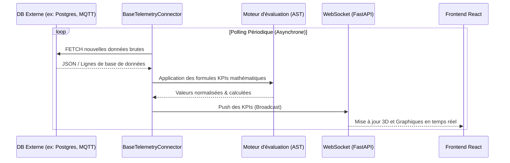
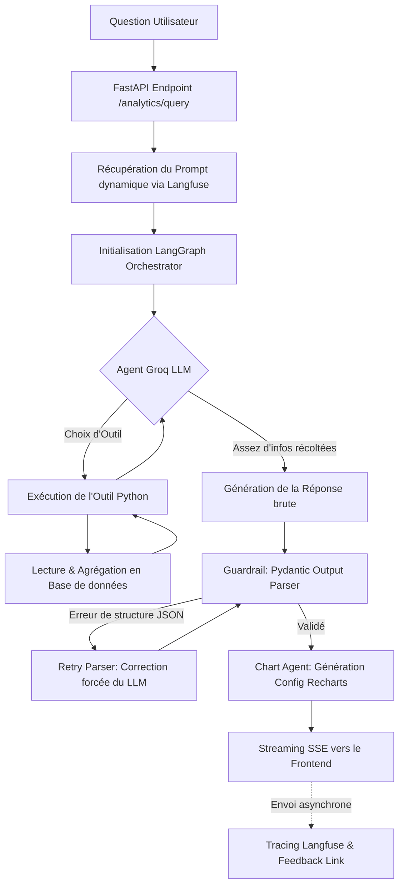

# Documentation Technique - Backend Digital Twin

Le Backend du Jumeau Numérique est le cœur de la plateforme, développé en **Python 3.10+** avec **FastAPI**. Il est en charge de la gestion asynchrone des flux de données, de l'abstraction des bases de données de télémétrie, et de l'orchestration avancée de l'Intelligence Artificielle.

## 🏗️ Architecture et Design Patterns

Ce backend est construit autour de piliers architecturaux conçus pour la performance et la scalabilité :

1. **Architecture Orientée Service (SOA)** : Séparation claire entre les "Routers" (Endpoints API), les "Services" (logique métier partagée) et les "Connectors" (gestion du polling réseau).
2. **Asynchronisme (Async/Await)** : Utilisation massive de `asyncio` pour gérer des centaines de connexions WebSockets et d'appels HTTP (notamment vers les API Groq et Langfuse) simultanément sans bloquer le thread principal.
3. **Multi-Agent Orchestration** : Utilisation de LangGraph pour structurer les chaînes de pensée de l'IA sous forme de graphes orientés.

---

## 📡 Moteur de Télémétrie (Streaming)

Le module de télémétrie (`routers/data_source.py` et `/connectors/`) est responsable de la transformation de données brutes externes (souvent chaotiques) en signaux "Jumeau Numérique" propres et utilisables.



### Évaluation Mathématique Sécurisée (AST)
Pour transformer un champ de base de données brut `vibration_raw` en un KPI métier complexe `vibration_rms`, l'utilisateur peut configurer une formule mathématique dans l'interface. Pour des raisons strictes de sécurité, le backend n'utilise **jamais** de fonction dangereuse comme `eval()`. Il parse les formules via un **AST (Abstract Syntax Tree)** sécurisé (librairie `simpleeval`), limitant les opérations aux pures mathématiques et évitant toute injection de code système.

---

## 🧠 Mécanique de l'Agent NLQ (LangGraph)

L'agent NLQ est le chef d'orchestre interactif. Voici le déroulé technique exact de ce qui se passe lorsqu'une question est posée par un opérateur sur le Jumeau Numérique :



### 1. Tool Calling (Appel d'Outils IA)
Le LLM n'a pas la capacité technique d'exécuter de vraies requêtes SQL arbitraires (trop dangereux). À la place, il dispose d'outils ("Tools") définis et documentés dans `tools.py` :
- `get_kpi_list`
- `get_kpi_statistics`
- `compare_kpi_across_components`
- `get_kpi_trend_over_time`

L'agent LLM génère une demande d'utilisation d'outil. Le framework LangGraph intercepte cette demande, exécute la fonction Python localement et de manière sécurisée, puis injecte le résultat textuel dans le contexte cognitif de l'agent.

### 2. Guardrails (Sécurité des outputs)
Une fois l'analyse terminée, l'agent doit formater sa réponse dans un objet JSON strict pour le frontend. Le backend intègre un parseur **PydanticOutputParser**. Si la réponse n'est pas conforme au schéma technique attendu, une exception est levée et le système peut gérer le nettoyage avant que l'interface utilisateur ne soit compromise.

### 3. Langfuse et Observabilité LLMOps
La transparence est clé en production. Lors de l'initialisation de l'agent pour une question, un identifiant unique est généré :
```python
trace_id_uuid = uuid.uuid5(uuid.NAMESPACE_DNS, f"query_{db_query_id}")
config = {"recursion_limit": 10, "run_id": trace_id_uuid}
```
Ce `run_id` est intercepté par Langfuse, ce qui permet de grouper tous les appels d'API, les temps d'exécution des outils, et la consommation de tokens sous une même trace visuelle. L'Endpoint `/feedback` utilise ensuite ce même UUID pour associer les votes utilisateurs ("👍 / 👎") directement à l'arbre de décision de l'agent.

---

## 📂 Structure du Répertoire

- `/agents/` : L'intelligence de l'application. Contient les scripts LangChain/LangGraph (`nlq_agent.py`, `chart_agent.py`, `kpi_agent.py`, `layout_agent.py`, `tools.py`).
- `/connectors/` : Classes abstraites et implémentations pour l'ingestion de données tierces en flux asynchrones.
- `/db/` : Modèles SQLAlchemy (`models.py`, `database.py`) gérant les métadonnées, l'authentification et les historiques.
- `/routers/` : Les contrôleurs de l'API (Routes FastAPI). Ex: `/analytics`, `/kpis`, `/layout`.
- `/services/` : Logique métier partagée (`llm_service.py` pour la configuration IA et l'accès dynamique aux prompts Langfuse).

---

## 🚀 Démarrage Rapide

Assurez-vous de configurer votre fichier `.env` avec les bonnes clés API (notamment `GROQ_API_KEY` et vos variables `LANGFUSE_*`).

```bash
uvicorn main:app --reload
```

L'API et le Swagger de documentation seront accessibles sur `http://localhost:8000/docs`.
